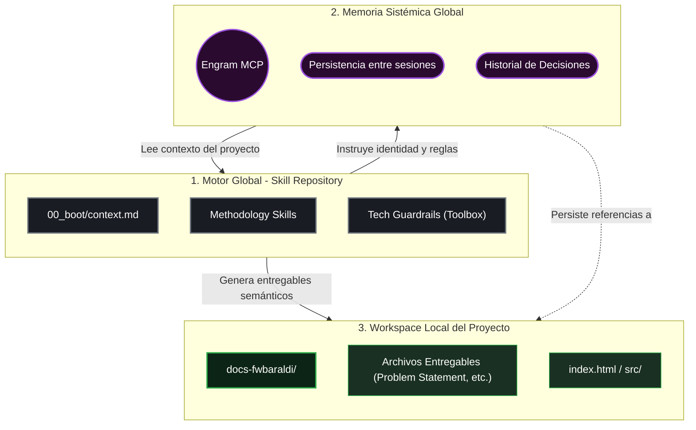
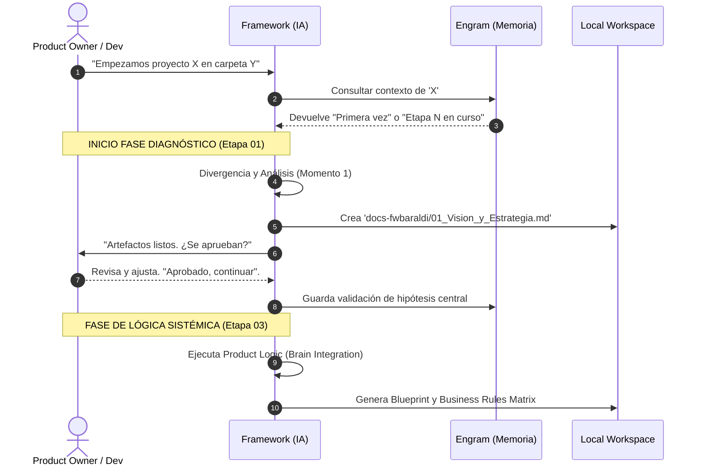

# Arquitectura Core del Framework Baraldi

> Este documento detalla la estructura lógica, la arquitectura tecnológica y el ciclo de vida de adopción del **Framework Baraldi** (v2.25.10). El framework ha evolucionado de un repositorio de prompts a un **Ecosistema Agéntico Simbiótico** donde la infraestructura tecnológica y la maestría humana convergen.

---

## 1. La Propuesta de Valor (El "Por qué")

### De Herramienta Táctica a Ecosistema Simbiótico
La interacción típica con la IA es un entorno transaccional (pregunta-respuesta) donde el contexto se pierde o se satura rápidamente. El **Framework Baraldi** rompe este paradigma transformando a la IA de un "chat táctico" a un **Orquestador de Producto Sistémico**.

Este ecosistema se basa en la **Simbiosis Cognitiva**:
- El humano aporta el contexto ético, la intuición y la brújula estratégica.
- La IA aporta el rigor dogmático, la memoria de largo plazo y la capacidad de análisis sistémico.
- Obliga a pasar por etapas de **divergencia y diagnóstico** antes de programar una sola línea de código.
- Aisla las decisiones (Problema → Entorno → Lógica → Interfaz) impidiendo la mezcla riesgosa de diagnóstico con solución.
- Genera y documenta evidencia real para sostener la construcción técnica y comercial del producto.

---

## 2. Arquitectura "Cero-Copia" (Zero-Copy)

Para evolucionar a una herramienta escalable en múltiples proyectos simultáneos, el framework se sustenta en una **Arquitectura Tripartita de Cero-Copia**.

### Concepto Central
Ningún archivo metodológico, de identidad de la IA, o plantillas de sistema debe "parásitar" o clonarse en la carpeta local del proyecto de tu empresa. El proyecto debe permanecer limpio y alojar **únicamente** el código puro y los documentos de salida generados.

### Diagrama de la Arquitectura Tripartita

* **Motor Global (Skill Directory):** Vive oculto en tu gestor de IA (Antigravity). Contiene el ADN de comportamiento y las instrucciones puras.
* **Memoria Sistémica (Engram MCP):** Actúa como la base de datos centralizada. En lugar de guardar archivos `.md` de memoria repartidos por tu PC, todos los hallazgos y en qué etapa está un proyecto viven aquí. Si cruzas aprendizajes entre dos proyectos distintos, Engram lo nota.
* **Workspace Local:** Tu carpeta. El Agente tiene orden estricta de dirigir todo entregable final a un folder ordenado y semántico (`docs-fwbaraldi/`).

---

## 3. Ciclo de Vida y Flujo Operacional

El avance del diseño no es orgánico, obedece a un flujo estructurado de Gates (Compuertas) donde la IA avanza de "Momento en Momento", requiriendo siempre intervención y aprobación humana para continuar.

### 3.1 El Rol de la Etapa 03 (Product Logic)
Tras completar la actualización v2.25.12, la Etapa 03 se consolida como el **"Cerebro del Producto"**. Su función es blindar la viabilidad funcional antes de que el equipo de diseño entre a la fase visual. 

**Entregables clave al usuario:**
- **Service Blueprint:** Mapa de interacción front/back/soporte.
- **Data Dictionary:** Inventario de entidades y atributos.
- **Business Rules Matrix:** Leyes lógicas de comportamiento (If/Then).
- **KPIs Funcionales:** North Star Metric y puntos de medición.

---

### Regulación de Diálogo de Producto
Para evitar saturación cognitiva, existe el acuerdo de **Documentación vs Interacción**:
1. El **Plan de Implementación** (panel de tareas de la IDE) solo sirve para documentar bloqueos técnicos y progreso.
2. La **Interfaz del Agente** es el conducto de charla humana y estratégica. La IA nunca espera que el humano edite el plan; el humano lidera desde el diálogo natural.

---

## 4. Adopción, Escalabilidad y Proyectos Legacy

### 4.1 Abordar un Proyecto Nuevo (Greenfield)
Es el camino crítico primario. Al invocar el framework mencionando "Arranquemos el proyecto desde cero", el sistema inicializa obligatoriamente en la **Etapa 01 - Problem Framing**. 
El objetivo primario aquí es *No escribir código hasta resolver los gaps de conocimiento del negocio.*

### 4.2 Sincronización de Proyectos En Curso (In-flight / Legacy)
Uno de los mayores desafíos metodológicos es aplicar rigor a un proyecto que ya cuenta con meses de desarrollo. 

Si un proyecto ya está comenzado, **NO obligamos al equipo a empezar de Etapa 01** repitiendo investigación redundante. Para esto usamos el concepto de **Auditoría de Sincronización**:

1. **Invocación Híbrida:** El usuario indica *"Quiero sumar este código legacy al Framework Baraldi"*.
2. **Escaneo Superficial:** El Agente escanea las carpetas y levanta un inventario de lo que *hay* vs lo que *debería haber*.
3. **Mapeo de Gaps:** En lugar de lanzar prompts de Etapa 01, la IA genera un "Matriz de Deuda Sistémica". Por ejemplo: *"Tienes el código funcionando (Etapa 05), pero no encuentro mapas de flujos lógicos (Etapa 03) ni métricas validadas (Etapa 01)."*
4. **Acuerdo de Purismo:** El usuario y la IA deciden el nivel de purismo a adoptar. Puede ser que solo necesitemos correr la **Etapa 02 (System Analysis)** para documentar las dependencias ocultas, e ignorar el Problem Framing porque la empresa asume ese riesgo.

> Esto garantiza que el framework actúe como un **consultor flexible** y no como un sistema burocrático bloqueante.
