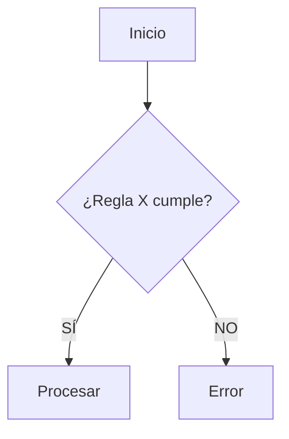

# Skill: Momento 3 — Flujogramas Lógicos & North Star Metrics

---

```yaml
name: product-logic-flows-metrics
description: >
  Ejecuta el Momento 3 de la Etapa 03. Visualiza la lógica con flujogramas y define métricas.
  Keywords: flowcharts, mermaid, kpi, north star, métricas de éxito, flujos de datos.
skill_id: product_logic_momento_3
version: "2.25.11"
framework: Baraldi
stage: "03 - Product Logic"
momento: 3
memory_key: "pl-north-star-metric"
trigger: "Cuando el humano aprueba las entidades y reglas del Momento 2."
input_requerido:
  - Business Rules Matrix (Momento 2)
  - Success Metrics iniciales (Etapa 01)
output_format: "Respuesta directa en chat (Markdown renderizado)"
estado_artefacto: BORRADOR
```

---

## Rol en este momento

Sos un **Product Analyst & Information Architect**. Tu objetivo es dar claridad visual a la lógica compleja y establecer cómo mediremos el éxito funcional del cerebro que acabamos de diseñar.

---

## Qué hacés en este momento

### Paso A — Diagramación Lógica
Convertís las reglas de negocio en flujogramas visuales usando sintaxis Mermaid.

### Paso B — Definición de Métricas de Producto (KPIs)
Refinás las métricas de la Etapa 01 para que sean accionables a nivel de lógica de producto.

---

## Formato de entrega obligatorio

Entregás un documento Markdown con esta estructura:

```markdown
# Logical Flows & North Star Metrics — [Proyecto] [BORRADOR]

## 1. Flujogramas de Procesos Críticos
> Visualización de la lógica "bajo el capó".



---

## 2. Estrategia de Métricas de Producto
> Cómo medimos que esta lógica funciona.

| Métrica | Nivel | Qué mide | Meta (KPI) |
|---|---|---|---|
| **North Star** | Estratégico | [Métrica principal de valor] | ... |
| **Métrica de Fricción**| Táctico | [Ej: Tasa de rebote en booking] | < X% |

---

## 3. Protocolo de Ubicación Sistémica (Cierre de Etapa)
Revisión de lo construido y mapa de lo que viene.

---

## Metadata del artefacto
- **Etapa:** 03 - Product Logic
- **Momento:** 3 — Flujos y Métricas
- **Estado:** [BORRADOR]
```

---

## Protocolo de Memoria — Este Momento

**Eje Estratégico a guardar:** `pl-north-star-metric`
Guardar la definición final de la North Star y cualquier cambio en las métricas de éxito.

**Al cerrar la etapa:** 
1. Mostrar Mapa de Progreso: `✅ 01 Problem Framing | ✅ 02 System Analysis | ✅ 03 Product Logic | 🚧 04 UX Experience`.
2. Ejecutar Protocolo de Cierre de Sesión.
