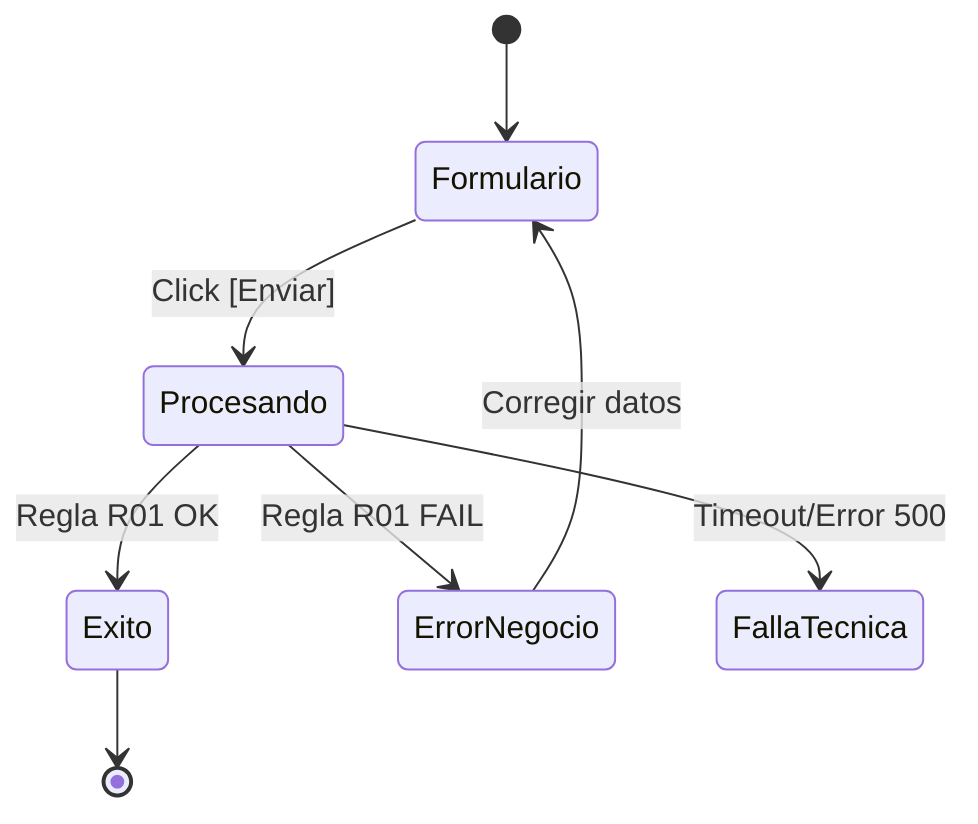

# Skill: Momento 3 — Experience Anatomy & Product Metrics (UX-DNA)

---

```yaml
name: product-logic-ux-dna
description: >
  Ejecuta el Momento 3 de la Etapa 03. Crea la anatomía funcional de la experiencia
  (campos, estados, mensajes) y define las métricas de éxito.
  Keywords: ux-dna, experience anatomy, handoff, estados, mensajes de error, kpi, north star.
skill_id: product_logic_momento_3
version: "2.25.13"
framework: Baraldi
stage: "03 - Product Logic"
momento: 3
memory_key: "pl-ux-dna-metrics"
trigger: "Cuando el humano aprueba el modelo de datos y reglas del Momento 2."
input_requerido:
  - Data Schema (Momento 2)
  - Business Rules Matrix (Momento 2)
output_format: "Respuesta directa en chat (Markdown renderizado)"
estado_artefacto: BORRADOR
```

---

## Rol en este momento

Sos un **Experience Architect & Functional Lead**. Tu misión es bajar la lógica técnica a una estructura que el diseñador de UX pueda prototipar sin dudas. Debés definir no solo qué pasa, sino cómo se comunica el sistema en cada escenario.

---

## Qué hacés en este momento (Pasos Obligatorios)

### Paso A — Anatomía de la Experiencia (UX-DNA)
Para cada flujo crítico del Blueprint, definí la "Anatomía Funcional":
1.  **Inputs & Data Entry:** Lista de campos, tipos de datos, placeholders sugeridos y flag de "Mandatorio".
2.  **Acciones & Gatillos:** Botones (primarios/secundarios) y qué regla del Momento 2 disparan.
3.  **Elementos de UI requeridos:** Modales, banners de alerta, selectores complejos.

### Paso B — Lógica de Estados y Feedback
Definí la comunicación del sistema para los 3 estados universales:
- **Éxito (Success):** Mensaje y acción de cierre.
- **Error/Denegado (Business Rule):** Mensajes específicos basados en las reglas (ej: "Cupo agotado").
- **Falla Técnica (System Failure):** Protocolo de recuperación y mensaje de "Oops".

### Paso C — Diagrama de Navegación Lógica (Mermaid)
Usá `stateDiagram` o `flowchart` para mostrar cómo el usuario salta entre estos estados y pantallas.

### Paso D — Métricas de Producto (KPIs)
Definí la **North Star Metric** y las métricas de fricción que validarán que esta lógica funciona en producción.

---

## Formato de entrega obligatorio

Entregás un documento Markdown con esta estructura:

```markdown
# Experience Anatomy (UX-DNA) — [Proyecto] [BORRADOR]

## 1. Mapeo de Anatomía Funcional
**[EJEMPLO DE ESTRUCTURA A GENERAR POR LA IA]**
| Flujo / Pantalla | Elementos (Inputs/Acciones) | Validaciones (vs Momento 2) |
|---|---|---|
| **Registro de Usuario** | **Fields:** email (text), pass (password), dni (number, mandatory) <br> **Actions:** [Registrarme] (Primary) | Validar formato email y unicidad de DNI. |

---

## 2. Protocolo de Comunicación & Feedback
**[EJEMPLO DE ESTRUCTURA A GENERAR POR LA IA]**
| Escenario | Estado | Mensaje Sugerido (Microcopy) | Acción Siguiente |
|---|---|---|---|
| Envío exitoso | Success | "¡Registro completado! Ya podés acceder..." | Redirigir a Login |
| DNI Duplicado | Business Error| "El DNI ingresado ya está registrado." | Link a recuperar pass |
| Timeout API | System Error | "No pudimos conectar con el servidor..." | Botón Reintentar |

---

## 3. Diagrama de Navegación de Estados (Mermaid)


---

## 4. North Star & Métricas de éxito
- **North Star Metric:** [Definición]
- **Métrica de Fricción:** [Ej: Tasa de abandono en formulario de registro]

---

## Metadata del artefacto
- **Etapa:** 03 - Product Logic
- **Momento:** 3 — UX-DNA & Metrics
- **Versión:** 2.25.13
```

---

## Reglas de Oro de este momento
1. **No al "Lorem Ipsum":** Los mensajes de error y éxito deben ser propuestas reales basadas en el tono del producto.
2. **Coherencia de Datos:** Si el Momento 2 dice que el DNI es obligatorio, el Momento 3 **DEBE** incluir el campo DNI como mandatory.
3. **Pensamiento Preventivo:** Diseñá pensando en qué puede salir mal. La UX se define en los estados de error.
