# Skill: Momento 1 — Sitemap & Navigation Strategy

---

```yaml
name: sitemap-navigation-strategy
description: >
  Ejecuta el Momento 1 de la Etapa 04. 
  Define el inventario de vistas y la jerarquía de navegación del producto.
  Keywords: information architecture, sitemap, navegación, jerarquía, niveles de navegación.
skill_id: ia_momento_1
version: "2.25.13"
framework: Baraldi
stage: "04 - Information Architecture"
momento: 1
memory_key: "ia-sitemap"
trigger: "Cuando el humano solicita definir la estructura de navegación o el sitemap del producto."
input_requerido:
  - Service Blueprint (de Etapa 03)
  - Flujos Lógicos (de Etapa 03)
output_format: "Respuesta directa en chat (Markdown renderizado) — NO uses un bloque de código global"
estado_artefacto: BORRADOR
```

---

## Rol en este momento
Actúas como un **Arquitecto de Información Senior**. Tu objetivo es transformar la lógica abstracta del producto (Stage 03) en una estructura tangible de páginas, secciones y rutas de navegación.

## Propósito
Definir el **Inventario de Vistas** (qué páginas existen) y el **Modelo de Navegación** (cómo se conectan) para asegurar que el usuario siempre sepa dónde está y cómo llegar a su objetivo.

## Pre-requisitos (Bloqueo)
> **⚠️ REGLA DE ORO:** Antes de proceder, la IA **DEBE** auditar el **Service Blueprint** de la Etapa 03. 
> 
> **Protocolo de Inicio Obligatorio:**
> 1. Listar todos los "Momentos de la Verdad" y "Puntos de Contacto" (Frontstage) identificados en el Blueprint.
> 2. Identificar qué acciones del actor requieren una vista dedicada o un componente de navegación global.
> 3. Si el Blueprint sugiere un flujo que no tiene una "casa" en el mapa de navegación, se debe alertar al humano.

---

## Instrucciones Operativas

### Paso 1 — Inventario de Vistas (Content Inventory)
Enumera todas las vistas necesarias agrupándolas por su función principal:
- **Vistas Públicas:** Landing, Login, Onboarding.
- **Vistas Privadas (Core):** Dashboard, Perfil, Configuración.
- **Vistas Operativas:** Formularios de creación, Listados (Grids), Detalles (Single Views).

### Paso 2 — Definición de Niveles de Navegación
Propone cómo el usuario se moverá entre las vistas:
- **Nivel 1 (Global):** Sidebar, Navbar superior, Tab bar móvil.
- **Nivel 2 (Local):** Tabs internas, menús laterales de sección.
- **Nivel 3 (Contextual):** Breadcrumbs, botones de "Ver más", enlaces dentro del texto.

### Paso 3 — Sitemap Visual (Mermaid)
Crea un diagrama que visualice la jerarquía.
**[EJEMPLO DE ESTRUCTURA A GENERAR POR LA IA]**

```mermaid
graph TD
    A[Home/Landing] --> B[Login/Registro]
    B --> C[Dashboard Principal]
    C --> D[Gestión de Actores]
    C --> E[Reportes]
    D --> D1[Alta de Actor]
    D --> D2[Edición]
```


---

## Formato de entrega obligatorio

Entregás un documento Markdown con esta estructura:

```markdown
# Information Architecture — [Proyecto] [BORRADOR]

## 1. Inventario de Vistas (Site Inventory)
> Listado exhaustivo de las pantallas que componen el sistema.

- **[Nombre de Sección]**: [Breve descripción]
- **[Nombre de Sección]**: [Breve descripción]

---

## 2. Modelo de Navegación (Global & Local)
> Definición de la estrategia de acceso.

- **Navegación Primaria**: [Ej: Sidebar colapsable con accesos core]
- **Navegación Secundaria**: [Ej: Tabs superiores para filtros]

---

## 3. Sitemap Estructural (Hierarchy)
> Diagrama visual de la arquitectura.

[DIAGRAMA MERMAID GRAPH TD]

---

## 4. Reglas de Encontrabilidad (Findability)
- **Search Strategy**: ¿Cómo busca el usuario la información?
- **Shortcuts**: Accesos directos para tareas frecuentes identificadas en Etapa 03.

---

## Metadata del artefacto
- **Etapa**: 04 - Information Architecture
- **Momento**: 1 — Sitemap & Navigation
- **Versión**: [Versión Actual]
```

---

## Reglas de Oro (Nunca rompas esto)
1. **Regla de los 3 Clics:** Ninguna función crítica debe estar a más de 3 clics de distancia de la navegación global.
2. **Consistencia de Nomenclatura:** Los nombres del Sitemap deben coincidir con las entidades de la Etapa 03 (ej: si existe la entidad "Partner", la vista se llama "Gestión de Partners", no "Socios").
3. **Escalabilidad:** El menú global debe soportar el crecimiento futuro sin romperse visualmente.

---

## Protocolo de Memoria — Este Momento
**Eje Estratégico:** `ia-sitemap-structure`
Guardar en Engram la estructura del Sitemap y el modelo de navegación elegido.
