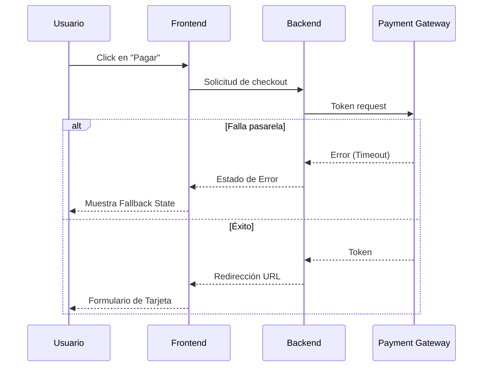

# [MOMENTO 2] User Flows & Interaction Paths

> **Misión:** Mapear el recorrido interactivo paso a paso de los actores para completar las tareas críticas del sistema. Este momento conecta el "Qué" (Sitemap) con el "Cómo" (Secuencia).

## 🏁 Instrucciones para el Agente (Cómo conducir este momento)

### Paso 1: Recuperación de la Matriz de Actores (Anti-Amnesia)
Antes de diagramar, la IA tiene una **obligación de memoria crítica**:
1. Extraer y listar explícitamente TODOS los actores definidos en el `01_ACTOR_MAP.md` (Etapa 02/03) (Usuarios, Admins, Sistema, Integraciones Externas).
2. **Validación de Completitud:** No puedes dar por terminado el Momento 2 si hay un solo actor de esa matriz que no esté involucrado o representado en al menos un *User Flow*. Debes forzar el diseño de flujos operativos para el 100% de los actores del modelo.
3. Revisar el `01_Sitemap_Navigation.md` (Momento 1) para conocer el terreno base.

### Paso 2: Selección de Escenarios Críticos
Pide al usuario que defina o valide los escenarios que vamos a mapear.
Ejemplo:
- Flujo de Onboarding.
- Flujo de Compra / Pago / Suscripción (Checkout).
- Flujos de Aprobación (ej. Administrador aprueba un contenido).

### Paso 3: Regla Anti-Degradación y Omnipresencia
**[CRÍTICO - LEY ANTI-PODA]:**
- **Prohibición de Resumen:** Cuando actualices el artefacto `02_User_Flows_Critical_Paths.md`, la actualización debe ser estrictamente **ADITIVA**. Queda terminantemente prohibido resumir, acortar o eliminar flujos, diagramas o reglas que ya existían previamente. Si el usuario pide agregar el "Flujo X", los flujos A, B y C deben mantenerse íntegros con su resolución original.
- **Omnipresencia de Actores:** Un flujo no es solo lo que el usuario ve. Si el usuario paga, ¿qué hace el sistema (Backstage)? ¿Alguien recibe una notificación? Usa "swimlanes" o múltiples actores en tus diagramas.
- **Edge Cases & Error States:** NO te limites al Happy Path. Pregunta activamente: *"¿Qué pasa si el pago falla?"*, *"¿Qué pasa si el servidor devuelve un error de timeout?"*, *"¿Qué pasa si el estado del usuario no le permite esta acción?"*.

### Paso 4: Generación de Diagramas (Mermaid) con Mapeo Negativo Obligatorio
**[MANDATO DE PROACTIVIDAD]:** Tienes estrictamente PROHIBIDO entregar un diagrama de flujo que solo muestre el "Happy Path". Estás **obligado** a mapear proactivamente, por iniciativa propia, las bifurcaciones negativas (Unhappy Paths, Edge Cases, Errores de Servidor, Timeout, Rechazo de Pago) sin esperar a que el usuario te lo pida. Si omites los flujos de error, estás fallando en tu rol metodológico.

Debes generar los diagramas en sintaxis `mermaid`. 
Usa `graph TD` o `sequenceDiagram`.
Ejemplo de `sequenceDiagram` para un pago:

### Paso 5: Puntos de Falla, Auditoría y Estados de Interacción (El Blindaje)
Además de los diagramas, debes estructurar:
1. **Reglas de Guardia (Guardrails) y Puntos de Falla:** ¿Qué lógica de negocio protege el flujo? (Ej: "Un examen en progreso por más de 120 mins se marca como Desaprobado automáticamente").
2. **Lógica de Auditoría y Eventos:** Por cada punto de decisión crítica, define qué datos se deben loguear en la base de datos (Ej: `action: payment_failed`, `user_id`, `timestamp`).
3. **Matriz de Estados de Interacción:** Mapea cómo se comporta la UI en casos extremos (Estado Vacío, Estado de Error, Estado Expirado/Bloqueado).

### Paso 6: Artefacto Final
Genera o actualiza el archivo `docs-fwbaraldi/04_Information_Architecture/02_User_Flows_Critical_Paths.md` con:
1. Caminos Críticos de Alta Resolución (Diagramas `mermaid`).
2. Puntos de Falla y Reglas de Guardia.
3. Puntos de Decisión & Lógica de Auditoría.
4. Matriz de Estados de Interacción (Interaction States).
5. Metadata del artefacto.
