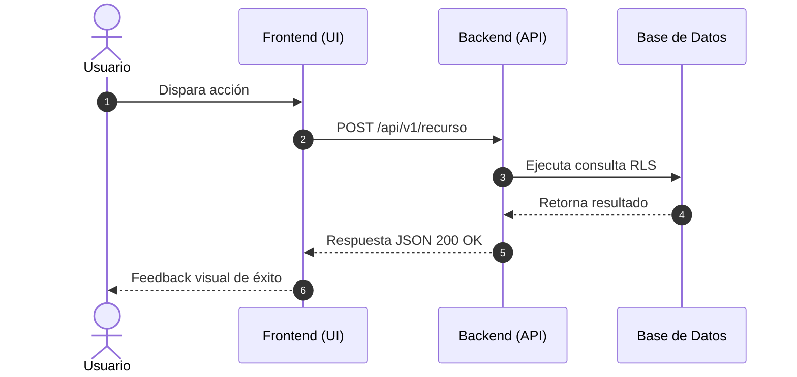

# Protocolo — Desglose Estratégico de Epics e Historias Hijas

Este protocolo actúa como el puente definitivo entre el **Product Design** y la **Ingeniería de Software**. Su objetivo es tomar grandes iniciativas estratégicas y dividirlas en unidades de trabajo atómicas, comprensibles y ejecutables sin fricciones.

---

## 1. Jerarquía de Desglose: Parent vs Child Tasks

Todo requerimiento se desglosa en dos capas bien diferenciadas:

```
┌─────────────────────────────────────────────────────────────┐
│                 PARENT EPIC / FEATURE TASK                  │
│       (Visión Negocio / PM / User Perspective - Cero Código)│
└──────────────────────────────┬──────────────────────────────┘
                               │
         ┌─────────────────────┼─────────────────────┐
         ▼                     ▼                     ▼
┌─────────────────┐   ┌─────────────────┐   ┌─────────────────┐
│  CHILD TASK 1   │   │  CHILD TASK 2   │   │  CHILD TASK 3   │
│ (API / Backend) │   │ (UI / Frontend) │   │ (Data / Analytics)
│  *Bloquea UI*   │   │  *Bloqueada*    │   │  *Tracking*     │
└─────────────────┘   └─────────────────┘   └─────────────────┘
```

---

## 2. Plantilla Canónica de Epic / Parent Feature

```markdown
# [EPIC] {Nombre de la Característica}

**Figma / Prototipo:** {Enlace al diseño o frame específico}

## 1. Visión General (Feature Overview)
{2-3 párrafos explicando qué resuelve esta iniciativa, a qué tipo de usuario beneficia y por qué es prioritaria según la Etapa 01.}

## 2. User Story (Perspectiva de Negocio)
> **Como** {tipo de usuario o rol},
> **Quiero** {realizar una acción concreta},
> **Para** {obtener un beneficio de negocio o resolver una fricción}.

## 3. Criterios de Aceptación (User Perspective)
- [ ] El usuario puede {acción principal}.
- [ ] En caso de error de red, el sistema muestra {estado amigable}.
- [ ] La interfaz responde en menos de 1 segundo.

## 4. Diagrama de Orquestación (Mermaid)


## 5. Tareas Hijas por Componente (Child Tasks Breakdown)

| # | Tipo | Título de la Tarea Hija | Componente | Dependencia | Criterio Técnico |
|---|---|---|---|---|---|
| 1 | `[FEATURE]` | Modelo de datos y endpoints | Backend (API) | - (Inicia primero) | Endpoints REST/GraphQL + RLS |
| 2 | `[FEATURE]` | Maquetado de vista y componentes | Frontend (UI) | Bloqueada por Tarea 1 | Tokens de `DESIGN.md` + A11y |
| 3 | `[FEATURE]` | Telemetría y eventos analíticos | Analytics | Tarea 2 | Eventos de tracking |

## 6. Fuera de Alcance (Out of Scope)
- {Declarar qué NO está incluido en esta versión para proteger el alcance}.
```

---

## NEVER List — Anti-patrones
- **NUNCA** crees un ticket gigante de "Hacer feature X" sin separar las responsabilidades de frontend y backend.
- **NUNCA** mezcles detalles técnicos de base de datos en la historia del usuario (Parent Story).
- **NUNCA** omitas la relación de dependencias ("La UI no puede terminarse sin el contrato de la API").

## ALWAYS List — Mandatos
- **SIEMPRE** adjunta el enlace a Figma o al `DESIGN.md` en las tareas de UI.
- **SIEMPRE** incluye diagramas Mermaid de secuencia o estados en flujos con lógica asíncrona.
- **SIEMPRE** numera los criterios de aceptación en formato de checklist binario (`[ ]`).

---
*Framework Baraldi v2.27.0 · Strategic Epic Slicing Protocol.*
