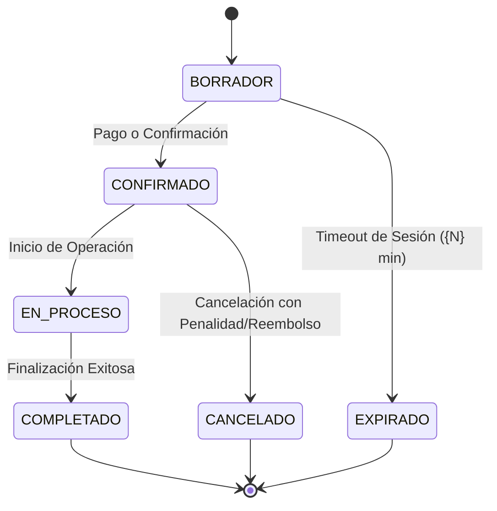

# 💼 Contrato de Negocio & Invariantes — {NOMBRE_DEL_PRODUCTO}

> **Fuente de Verdad de Lógica de Negocio:** Este documento define las reglas e invariantes sagradas del modelo de negocio. **Ningún cambio de código, refactorización o propuesta de IA puede violar estas directivas.**

---

## 🎯 1. Modelo de Monetización y Tiers / Planes

| Dimensión / Límite | Plan Free / Starter | Plan Pro / Growth | Plan Enterprise / Custom |
| :--- | :--- | :--- | :--- |
| **Precio Base** | $0 / mes | ${PRECIO_PRO} / mes | A convenir |
| **Límite de {Entidad Principal}** | Hasta {N} {entidades} | Hasta {N} {entidades} | Ilimitado |
| **Usuarios / Miembros por Cuenta** | {N} usuario(s) | Hasta {N} miembros | Miembros ilimitados |
| **Almacenamiento / Retención** | {N} días / {N} MB | {N} meses / {N} GB | Retención personalizada |
| **Soporte & SLA** | Comunidad / Asíncrono | Prioritario (< 24hs) | Dedicado 24/7 |

---

## 🛡️ 2. Invariantes Sagradas del Sistema (Non-Negotiable Rules)

Estas afirmaciones deben cumplirse siempre en base de datos, backend y frontend:

1. **Inmutabilidad Transaccional:**
   - Todo registro de pago, factura o transacción confirmada es **estrictamente inmutable**. No se editan ni se eliminan; los errores se corrigen emitiendo notas de crédito o eventos de anulación.
2. **Políticas de Cancelación y Reembolsos:**
   - Cancelaciones con más de `{N}` horas de anticipación: {Reembolso 100% / Crédito en cuenta}.
   - Cancelaciones con menos de `{N}` horas de anticipación: {Retención de seña del X%}.
3. **Control de Cuotas y Límites (Fair Use):**
   - Si un usuario alcanza el 100% de su límite permitido, el sistema **nunca debe romper silenciosamente ni borrar datos**; debe bloquear la creación de nuevos ítems y disparar el modal de Upgrade.
4. **Ciclo de Vida de Cuentas:**
   - La suspensión de una cuenta por falta de pago bloquea el acceso de escritura pero preserva los datos del cliente por `{N}` días antes de pasar al archivado.

---

## 🔄 3. Matriz de Estados de Transacciones Críticas

---

## 🚫 NEVER List — Prohibiciones de Negocio
- **NUNCA** permitas que un usuario consuma recursos de un tier superior sin validación en el backend (no confiar solo en validación de UI).
- **NUNCA** apliques descuentos acumulativos salvo que la regla de promociones lo declare explícitamente.
- **NUNCA** expongas datos o reportes de un Tenant a otro (Aislamiento absoluto).

---
*Framework Baraldi · docs-fwbaraldi/BUSINESS.md Template.*
